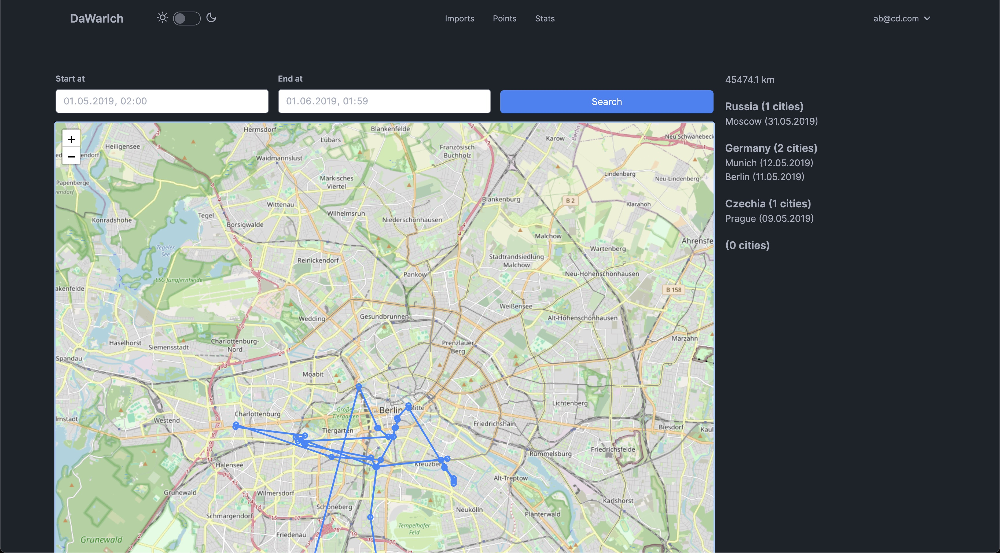
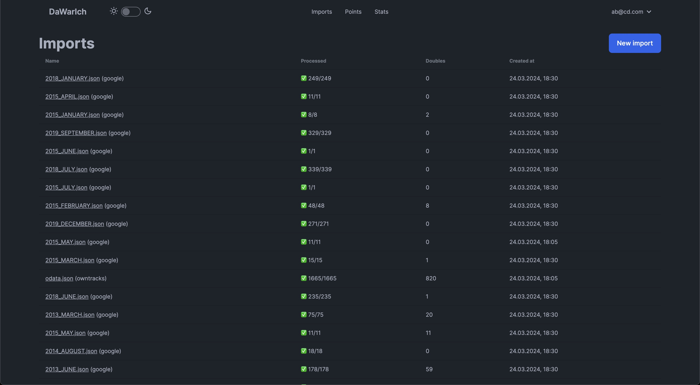

# Dawarich

Dawarich is a self-hosted web application to replace Google Timeline (aka Google Location History). It allows you to import your location history from Google Maps Timeline and Owntracks, view it on a map and see some statistics, such as the number of countries and cities visited, and distance traveled.

You can find changelog [here](CHANGELOG.md).

## Usage

To track your location, install the [Owntracks app](https://owntracks.org/booklet/guide/apps/) on your phone and configure it to send location updates to your Dawarich instance. Currently, the app only supports [HTTP mode](https://owntracks.org/booklet/tech/http/). The url to send the location updates to is `http://<your-dawarich-instance>/api/v1/points`.

To import your Google Maps Timeline data, download your location history from [Google Takeout](https://takeout.google.com/) and upload it to Dawarich.

## Features

### Location Tracking

You can track your location using the Owntracks app.

### Location history

You can view your location history on a map.

### Statistics

You can see the number of countries and cities visited, the distance traveled, and the time spent in each country, splitted by years and months.

### Import

You can import your Google Maps Timeline data into Dawarich as well as Owntracks data.

## How to start the app locally

`docker-compose up` to start the app. The app will be available at `http://localhost:3000`.

Press `Ctrl+C` to stop the app.

## How to deploy the app

Copy the contents of the `docker-compose.yml` file to your server and run `docker-compose up`.

## Environment variables

```
MINIMUM_POINTS_IN_CITY — minimum number of points in a city to consider it as a city visited, eg. `10`
MAP_CENTER — default map center, e.g. `55.7558,37.6176`
TIME_ZONE — time zone, e.g. `Europe/Berlin`
APPLICATION_HOST — host of the application, e.g. `localhost` or `dawarich.example.com`
```

## Screenshots






